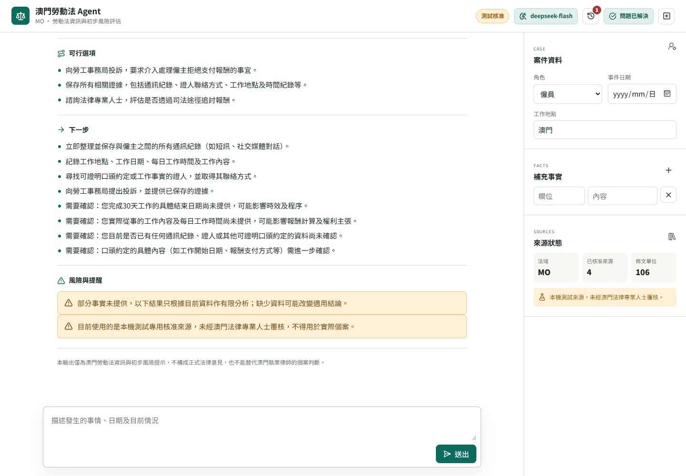
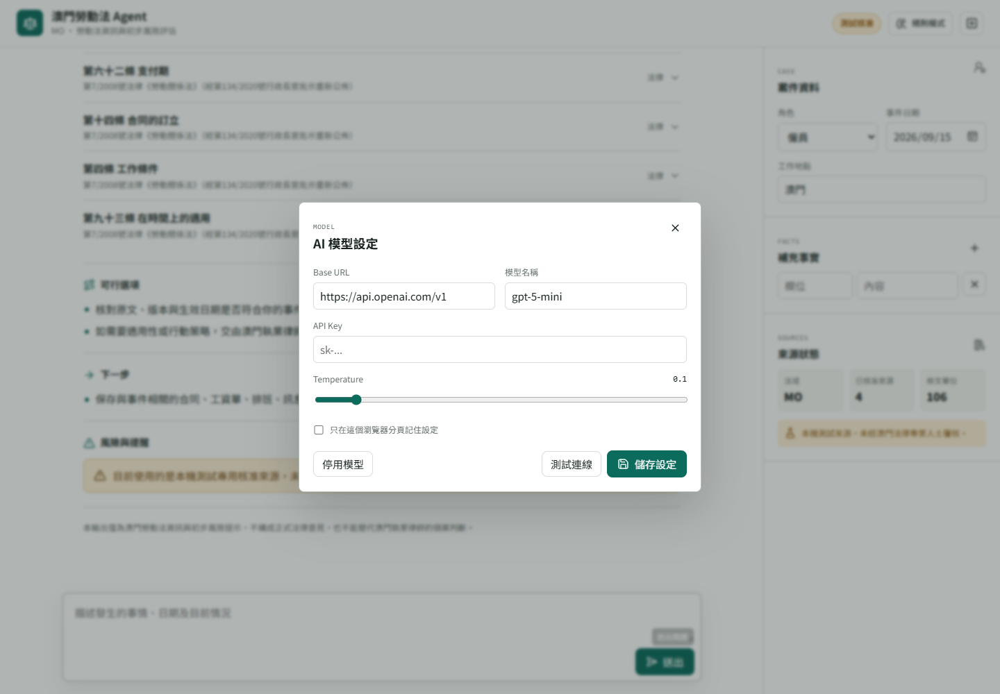
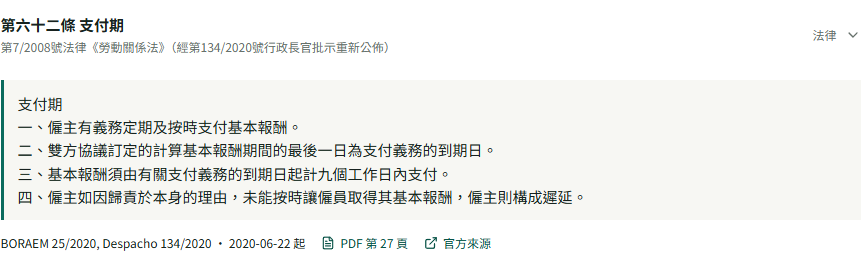

# 澳門勞動法 Agent

澳門特別行政區勞動法資訊、法源檢索、引用驗證及初步風險評估 Agent。



## 功能

- 可視化 Web 介面與命令列介面。
- 判斷使用者角色、議題及缺少的關鍵事實。
- 從已核准的澳門法源 registry 檢索條文。
- 支援事件日期及法規版本過濾。
- 每個法律主張都必須關聯證據並通過逐字引用驗證。
- 支援 OpenAI-compatible 模型，用於事實抽取、檢索規劃及受證據約束的分析。
- 支援「按現有資料分析」，缺少事實時仍可產生有限分析。
- 支援「問題已解決」，清除目前案件的對話與事實上下文。
- 瀏覽器本機歷史紀錄，可查看、重用及刪除之前的問題。
- 法源卡片可跳至官方 PDF 的對應頁碼。
- 高風險、引用失敗、版本衝突或角色衝突會升級真人處理。

## Agent 工作流

```text
A0 協調
  -> A1 受理與事實
  -> A2 檢索規劃
  -> A3 法源檢索
  -> A4 法律分析
  -> A5 引用驗證
  -> A6 風險與升級
  -> A7 回答組裝
  -> A8 審計與評估
```

模型只負責 A1、A2 與 A4。A3 檢索、A5 引用驗證及 A6 風險升級由確定性程式控制。

## 系統需求

- Python 3.11 或以上。
- 執行 Web UI 與 Agent 不需要額外 Python 套件。
- 重建官方 PDF registry 時需要 `pdfplumber`。

## 啟動 Web UI

```powershell
python run_ui.py
```

開啟：

```text
http://127.0.0.1:8765
```

指定其他連接埠：

```powershell
python run_ui.py --port 8877
```

## 停止 Web UI

前景執行時按：

```text
Ctrl+C
```

從另一個 PowerShell 視窗停止：

```powershell
$port = 8765
Get-NetTCPConnection -LocalPort $port -State Listen |
  Select-Object -ExpandProperty OwningProcess -Unique |
  ForEach-Object { Stop-Process -Id $_ -Force }
```

確認服務已停止：

```powershell
Get-NetTCPConnection -LocalPort 8765 -State Listen -ErrorAction SilentlyContinue
```

沒有輸出即代表服務已停止。

## AI 模型設定

點擊介面右上角「規則模式」開啟模型設定，填入：

- Base URL。
- 模型名稱。
- API Key。
- Temperature。

支援 OpenAI-compatible `/chat/completions` API。

DeepSeek 範例：

```text
Base URL：https://api.deepseek.com
模型名稱：deepseek-flash
```

API Key 預設只保存在目前頁面的 JavaScript 記憶體。勾選「只在這個瀏覽器分頁記住設定」後，才寫入 `sessionStorage`。

API Key 不會寫入：

- 法源 registry。
- 案件狀態。
- 歷史紀錄。
- Audit JSONL。



## 案件與歷史紀錄

「問題已解決」會：

- 通知後端解除目前 `case_id` 的角色鎖定。
- 清空目前對話、事實、回答及模型上下文。
- 建立新的 `case_id`，避免下一個問題混入舊案例。

歷史紀錄保存在本機瀏覽器：

- 最多保留 30 筆。
- 包含問題、狀態、摘要、條號、模型名稱及 `trace_id`。
- 不保存 API Key 或完整案件事實。
- 可重用問題、刪除個別紀錄或清除全部紀錄。

## 命令列

```powershell
python run_agent.py `
  --query "工資沒有依時支付，我可以怎樣做？" `
  --role employee `
  --fact work_location=澳門 `
  --fact event_date=2026-09-01
```

缺少事實時仍按目前資料分析：

```powershell
python run_agent.py `
  --query "口頭約定工作後僱主拒絕支付報酬" `
  --role employee `
  --fact work_location=澳門 `
  --allow-incomplete
```

互動追問模式：

```powershell
python run_agent.py --interactive
```

## 法源資料

目前 registry 包含 4 個來源、106 個 provision：

- 第 7/2008 號法律《勞動關係法》2020 合併版。
- 第 23/2024 號法律修改的第七十條。
- 第 9/2026 號法律即日生效的第五十四條及第五十六條。
- 第 9/2026 號法律延後至 2027-01-01 生效的第四十六條、第七十五條及第八十五條。

目前來源使用：

```text
review_status = approved
review_scope = test_only
```

這些來源未經澳門法律專業人士覆核，只供開發及測試，不可用於實際個案。

每個 provision 保存：

- 法規名稱、條號與標題。
- 條文原文。
- 生效日期與失效日期。
- 官方頁面網址。
- PDF 快照及 `page_start`、`page_end`。
- 版本標籤與 SHA-256 校驗碼。

法源卡片的「PDF 第 N 頁」會開啟官方 PDF 並跳至對應頁面。



## 私隱與安全

- 法域固定為澳門特別行政區。
- 只使用已核准且符合事件日期的法源。
- 不生成沒有來源支持的法條、條號或法律結論。
- 高風險、證據不足、版本衝突及引用失敗會阻止回答或升級真人。
- 同一案件不得混合僱員與僱主角色。
- 審計紀錄只保存來源 ID、狀態與風險代碼。
- 系統輸出不是正式法律意見。

## 測試

```powershell
python -m pytest
```

測試涵蓋：

- 法源 registry 與版本日期。
- 關鍵字檢索與 PDF 頁碼。
- LLM 規劃與受證據約束的分析。
- 引用驗證與錯誤引用阻止。
- 缺少事實與有限分析。
- 案件結案與角色鎖定。
- Web API、PDF Range 請求及安全 headers。

## 目錄

```text
src/laborlaw_agent/
├── models.py       # 共用狀態、證據與回答 schema
├── policies.py     # 議題、必要事實與高風險規則
├── repository.py   # 法源 registry、版本過濾與檢索
├── llm.py          # OpenAI-compatible 模型介面
├── agents.py       # A1-A8 邏輯角色
├── workflow.py     # A0 協調、結案與升級
├── audit.py        # 最小化審計紀錄
├── cli.py          # 命令列介面
└── web/            # Web API 與靜態前端
```

## 重建法源 Registry

安裝 PDF 解析套件：

```powershell
python -m pip install pdfplumber
```

從官方 PDF 重建：

```powershell
python scripts/build_macau_labor_registry.py --approve-for-testing
```

未傳入 `--approve-for-testing` 時，來源會標記為 `pending`。

## 相關文件

- `docs/source-policy.md`
- `docs/official-source-import.md`
- `docs/agent-contracts.md`
- `docs/llm-integration.md`

## 授權

本專案使用 MIT License，詳見 `LICENSE`。
